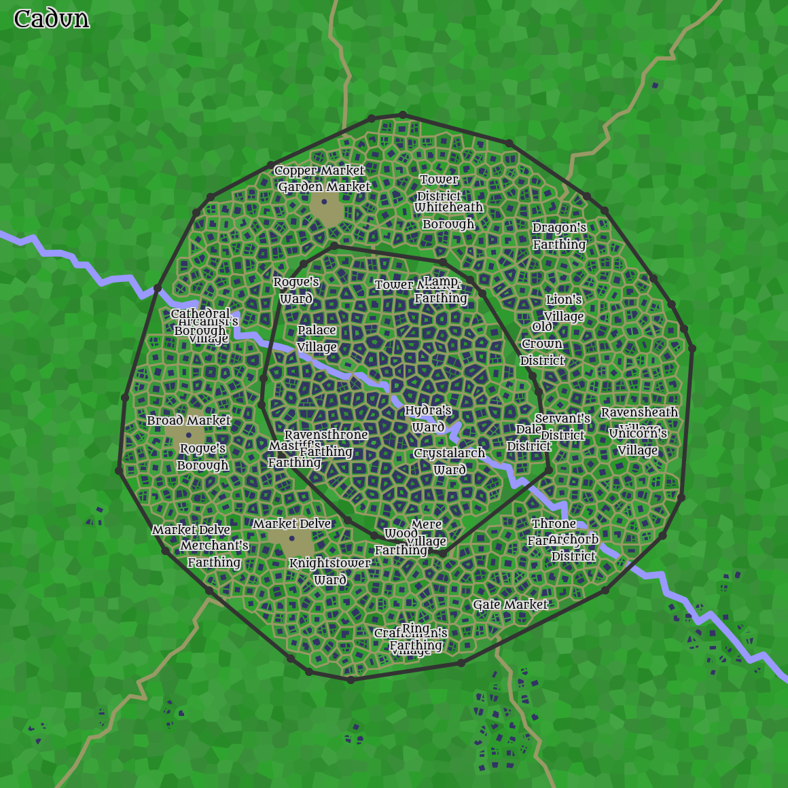

Located on the southern tip of the Bracewater Headland.

### Population:

-   Approximately 16000; mostly human, some dwarf, some elf, few fae-elf

### Government:

-   Cadun is governed by a court of aristocrats, though several wealthy merchants are the real power behind the throne.

### Notable Places:

-   Brythe's Armor and Shields: The workshop of a female human armorer named [[Brythe]], who is rumored to craft special gear.
-   The Pillory of Immortality: A madman has been trapped within this pillory for as long as anyone can remember. He does not age, and cannot be freed.
-   Ealchflead's Clocks: The workshop of a female human clockmaker named [[Ealchflead]], who is rumored to be immortal.

### A few NPCs:

-   Brihtieue: Female Human Merchant, Good. Brihtieue has short silver hair and blue eyes, and walks with a limp. She wears well-made clothing and a wide-brimmed hat. Brihtieue is hunting the warlord who stole her ancestral sword.
-   Cyna: Female Human Alchemist, Evil. Cyna is exceptionally beautiful, with silver hair and large brown eyes. She wears fine clothing and silk gloves. Cyna has an animal companion, a black rat named Elyn.
-   Milda: Female Human Alchemist, Neutral. Milda has grey hair and bright hazel eyes. She wears tailored clothing and a silver holy symbol. Milda is absent-minded and reserved.
-   Gery: Male Human Cleric, Evil. Gery has thick golden hair and brown eyes, and a wide mouth. He wears banded mail and wields a mace. Gery seeks to save his family from financial ruin.
-   Mery: Female Human Entertainer, Neutral. Mery has long auburn hair and green eyes, and a distinctive mark on her face. She wears well-made clothing and a sling of vials and potions. Mery is confident and superstitious.

## Archorb District

### Notable Places:

-   The Garden of Statues: An overgrown garden filled with weirdly life-like stone statues. It is said that a medusa's lair lies somewhere within the hedge labyrinth.
-   The Dryad's Tree: A great tree stands here, gnarled with age but green and strong. It is said to be the home of a dryad, and that anyone who kisses the tree will be lucky for the rest of the day.
-   Nichye's Pottery: A cluttered potter's workshop, built around a shrine of Penem, Lord of Earth.

### A few NPCs:

-   Witha: Female Human Scholar, Neutral. Witha is exceptionally beautiful, with uneven silver hair and soft amber eyes. She wears expensive clothing and a feathered hat. Witha has an animal companion, a hunting dog named Philia.
-   Kada: Male Dwarf Cleric, Evil. Kada is fair in appearance, with silver hair and brown eyes. He wears banded mail and wields a quarterstaff. Kada is aloof and instinctive.
-   Anen: Female Human Craftsman, Evil. Anen is common in appearance, with long auburn hair and brown eyes. She wears modest garments and a blue cloak. Anen holds a grudge against wizards.

## Broad Market

### Notable NPCs:

-   Marger: Female Human Slaver, Evil. Marger has messy copper hair and soft green eyes. She wears modest garments and a wooden holy symbol. Marger can procure dopplegangers for special customers.
-   Nathye: Male Human Chandler, Good. Nathye has short copper hair and light blue eyes. He wears well-made clothing and an iron amulet. Nathye also deals in forged documents and seals.
-   Rega: Female Human Woodseller, Good. Rega is courtly in bearing, with brown hair and large amber eyes. She wears well-made clothing and carries a long knife. Rega also deals in smuggler's maps.

## Cathedral Borough

### Notable Places:

-   The Courthouse: A large stone-walled building, filled with busy magistrates and advocates.
-   An ancient obelisk of polished stone, placed to mark the Battle of Sige Castle.

### A few NPCs:

-   Wine: Male Human Assassin, Neutral. Wine has blonde hair and large hazel eyes. He wears leather armor and wields a poisoned long sword and sling. Wine is lewd and curious.
-   Warieua: Female Human Thief, Neutral. Warieua is fair in appearance, with blonde hair and green eyes. She wears leather armor and wields a long sword and dagger. Warieua has a dire rat named William.
-   Awils: Male Human Peasant, Evil. Awils has black hair and green eyes. He wears modest garments and riding boots. Awils believes that he's being hunted by supernatural creatures.
-   Walteph Page: Male Human Soldier, Good. Walteph has cropped blonde hair and amber eyes, and wears glasses with brass rims. He wears chain mail and wields a military pick. Walteph lost his shadow to a hag.
-   Fastri: Male Dwarf Mercenary, Evil. Fastri has a narrow face, with black hair and dark brown eyes. He wears chain mail and wields a long sword and heavy crossbow. Fastri has an animal companion, a silver cat named Vidi.

## Crystalarch Ward

### Notable Places:

-  A four story timber and stone walled library of [[Zaban]] resides here.
-   A two-storey building of timber and brick walls, the home and personal library of a male human sage named [[Aenbulf]]. He specializes in the study of legendary heroes and battles.
-   Wulfa's Masonry: The workshop of a male human stonemason named Wulfa, who is rumored to have arranged the murder of the previous guildmaster.

### A few NPCs:

-   Gune: Male Human Cleric, Evil. Gune has white hair and grey eyes, and a burnt right hand. He wears banded mail and wields a flail. Gune has an acute fear of open spaces.
-   Edmur Bole: Male Human Cleric, Evil. Edmur is short, with thin red hair and dark amber eyes. He wears plate mail and wields a flail. Edmur is secretive and destructive.
-   Marget: Female Human Alchemist, Evil. Marget is heavyset, with messy auburn hair and dark green eyes. She wears fine clothing and carries a fine stiletto. Marget is arrogant and practical.

## Dale District

### Notable Places:

-   A ruined keep of blackened stone walls, said to be haunted by the shadows of the warriors who failed to defend it.
-   The broken ruins of a small castle, which appears restored upon the night of both new moons.

### A few NPCs:

-   Geda: Male Dwarf Mercenary, Neutral. Geda has a narrow face, with golden hair and brown eyes. He wears scale mail and wields a short sword. Geda has an animal companion, a hawk named Tyrke.
-   Here: Female Human Thief, Evil. Here is short, with straight white hair and soft blue eyes. She wears leather armor and wields a dagger and darts. Here is deceitful but courageous.

## Garden Market

### Notable NPCs:

-   Aecgwyth: Female Human Peddler, Evil. Aecgwyth is exceptionally beautiful, with braided copper hair and grey eyes. She wears sturdy clothing and several pouches hang from her belt. Aecgwyth specializes in goblin weapons and armor.
-   Joycie: Female Human Guard, Neutral. Joycie has a narrow face, with thin blonde hair and large hazel eyes. She wears studded leather and wields a spear. Joycie is known for her jeweled sword, a gift from the Lord Mayor.
-   Mera: Female Human Butcher, Evil. Mera has uneven white hair and brown eyes. She wears travel-stained clothing and a bronze amulet. Mera is rumored to lead a cult of an aberrant goddess.
-   Grobern: Male Human Peddler, Evil. Grobern has grey hair and narrow grey eyes, and an uneven beard. He wears worn clothing and several small tools hang from his belt. Grobern will purchase monster teeth for a copper coin each.
-   Elyn: Female Human Butcher, Neutral. Elyn is tall and slender, with messy golden hair and amber eyes. She wears sturdy clothing and a wide-brimmed hat. Elyn is known for her impossible luck.

## Lamp Farthing

### Notable Places:

-   The Hunting Gypsy: A heroic elven tavern, built within the walls of an ancient iron keep.
-   The Astrologers Guild Hall: A large half-timbered building, decorated with wards against demons.

### A few NPCs:

-   Gamul: Male Dwarf Soldier, Neutral. Gamul has curly grey hair and bright green eyes, and a small mouth. He wears chain mail and wields a long sword. Gamul lost his reflection to a hag.
-   Soxi: Male Dwarf Ranger, Evil. Soxi is overweight, with blonde hair and brown eyes. He wears chain mail and wields a bastard sword and short bow. Soxi seeks to free himself from an ancient curse.

## Lion's Village

### Notable Places:

-   Enged's Arsenal: The workshop of a female human weaponsmith named [[Enged]], known for her blades, which shine with a cold light when orcs are near.
-   The ruins of Teray Tower.
-   Ames' Pewter: The workshop of a male human pewtersmith named Ames, who is possessed by the ghost of a silver dragon.

### A few NPCs:

-   Therli Hranison: Male Dwarf Fighter, Evil. Therli has straight copper hair and grey eyes. He wears plate mail and wields a spear and long bow. Therli refers to himself in the third person.
-   Zigiml: Female Dwarf Alchemist, Neutral. Zigiml has grey hair and bright blue eyes. She wears modest garments and a silver holy symbol. Zigiml has an animal companion, a red fox named Erid.

## Market Delve

### Notable NPCs:

-   Ellell: Female Human Entertainer, Neutral. Ellell has messy grey hair and grey eyes, and numerous unusual scars. She wears modest garments and an amulet of luminous crystal. Ellell is known as the best actor in town.
-   Ethen: Female Human Thief, Neutral. Ethen has braided white hair and light hazel eyes, and wears glasses with pewter rims. She wears leather armor and wields a long sword and sling. Ethen seems to know a secret about everyone.
-   Aethed: Female Human Fishmonger, Good. Aethed is heavyset, with silver hair and hazel eyes. She wears simple clothing and several small tools hang from her belt. Aethed sometimes has interesting items from sunken ships to sell.
-   Symart Warre: Male Human Peddler, Good. Symart has uneven black hair and hazel eyes, and a flat nose. He wears well-made clothing and carries a long knife. Symart will purchase monster teeth for a copper coin each.
-   [[Egild]]: Female Human Peddler, Neutral. Egild is rugged in appearance, with silver hair and light green eyes. She wears modest garments and a wooden holy symbol. Egild is known for her knowledge of legends and folklore.

## Merchant's Farthing

### Notable Places:

-   The Guardhouse: A buttressed half-timbered building, a station of of the town guard. A long-dead siege golem stands in front of the building.
-   The Coliseum: A large semi-circular amphitheatre, known for its trials by combat.

### A few NPCs:

-   Behrtio: Male Human Illusionist, Good. Behrtio is stout, with curly white hair and brown eyes. He wears well-made clothing and wields a quarterstaff and sling. Behrtio has an animal companion, a silver weasel named Thene.
-   Withburg: Female Human Alchemist, Good. Withburg is exceptionally beautiful, with cropped grey hair and light amber eyes. She wears expensive clothing and a silver holy symbol. Withburg has a deadly allergy to moulds and oozes.
-   Bifund: Male Dwarf Alchemist, Neutral. Bifund has cropped blonde hair and soft grey eyes. He wears tailored clothing and a dragonscale cloak. Bifund is hunting the warlord who murdered his family.
-   Alil: Female Human Aristocrat, Good. Alil has a narrow face, with golden hair and sharp amber eyes. She wears fine raiment and a feathered hat. Alil is easily distracted by magic.

## Palace Village

### Notable Places:

-   Riffin's Pottery: The workshop of a male human potter named Riffin, who was once a great wizard, but retired after defeating Lord Greywulf.

### A few NPCs:

-   Arun: Male Dwarf Cleric, Good. Arun is tall and willowy, with silver hair and grey eyes. He wears plate mail and wields a hammer. Arun is adaptable and quiet.
-   Rancent: Male Human Illusionist, Evil. Rancent has a long face, with curly brown hair and blue eyes. He wears tailored clothing and wields a quarterstaff. Rancent refers to himself in the third person.
-   Kilmah: Male Dwarf Alchemist, Good. Kilmah has white hair and brown eyes. He wears fine clothing and a dragonscale cloak. Kilmah seeks to free himself from an ancient curse.
-   Marey Reyney: Female Human Scholar, Neutral. Marey is short, with black hair and green eyes. She wears well-made clothing and an amulet of luminous crystal. Marey is wrongly sought by the Count of Enothlond for theft.

## Ravensthrone Farthing

### Notable Places:

-   The Weary Fool: An elegant commoner's inn, built within a ring of ancient stone monoliths.

### A few NPCs:

-   Iffin: Male Human Craftsman, Evil. Iffin has long brown hair and blue eyes, and a short beard. He wears travel-stained clothing and riding boots. Iffin has an animal companion, a grey rat named Ralphye.
-   Stilbue: Male Dwarf Craftsman, Good. Stilbue is tall, with black hair and sharp brown eyes. He wears plain clothing and riding boots. Stilbue secretly serves Zepar, an ancient god of destruction.
-   Alin: Male Dwarf Ranger, Evil. Alin is fair in appearance, with copper hair and green eyes. He wears chain mail and wields a long sword. Alin seeks to steal the crown of the kingdom.
-   Piersym Rete: Male Human Mercenary, Evil. Piersym is haughty in bearing, with golden hair and bright brown eyes. He wears chain mail and wields a bastard sword and javelins. Piersym has an animal companion, a red firedrake named Witha.
-   Ealdred: Male Human Paladin, Good. Ealdred has straight blonde hair and narrow blue eyes. He wears banded mail and wields a warhammer and shield. Ealdred dislikes having people behind him.

## Ring Farthing

### Notable Places:

-   The ruins of a six-sided tower, which appears restored upon the night of the solstice.

### A few NPCs:

-   Bether: Female Human Cleric, Neutral. Bether is exceptionally beautiful, with white hair and grey eyes. She wears plate mail and wields a hammer. Bether seeks the meaning of a strange prophecy.
-   Abell: Female Human Scofflaw, Good. Abell has cropped blonde hair and light hazel eyes. She wears modest garments and carries a hazel staff. Abell has an animal companion, a silver cat named Jane.
-   Elyellas: Female Elf Paladin, Good. Elyellas is rough in appearance, with straight silver hair and dark amber eyes. She wears splint mail and wields a spear and shield. Elyellas is a pack-rat, and carries a satchel of random junk.
-   Joane Arper: Female Human Ranger, Evil. Joane has grey hair and brown eyes, and a magical scar on her leg. She wears scale mail and wields a flail. Joane lost her right eye to an injury.
-   Funda: Male Dwarf Mercenary, Evil. Funda has a long face, with brown hair and green eyes. He wears studded leather and wields a glaive-guisarme. Funda has a paralyzing fear of darkness.
-   Earad: Female Human Scholar, Neutral. Earad has brown hair and soft hazel eyes. She wears modest garments and a rabbit fur cape. Earad is ambitious, but complains bitterly about her lack of resources.

## Tower District

### Notable Places:

-   A monolith of rough-hewn stone, said to entomb the bones of a local god of war.
-   Hell's Close : A narrow alley which ends at the broken ruins of a warlock's tower. Anyone walking towards the ruins becomes enveloped by phantasmal flames.

### A few NPCs:

-   Arget: Female Human Assassin, Neutral. Arget has golden hair and hazel eyes, and a beaked nose. She wears leather armor and wields a poisoned club. Arget is searching for her lost sister.
-   Eathurg: Female Human Ranger, Neutral. Eathurg is short, with white hair and hazel eyes. She wears studded leather and wields a warhammer. Eathurg has a black dog named Ulfgeard.
-   Kather: Female Human Professional, Good. Kather is exceptionally beautiful, with silver hair and dark blue eyes. She wears modest garments and several pouches hang from her belt. Kather seeks to save her family from financial ruin.
-   Hari: Male Dwarf Thief, Neutral. Hari has a narrow face, with long white hair and soft amber eyes. He wears leather armor and wields a long sword. Hari seeks revenge against the aristocrat who framed him.

## Unicorn's Village

### Notable Places:

-   The House of Silver: A grand stone-walled theatre, said to be built upon the ground where a sidhe noble was betrayed and murdered.
-   The Buzzing Tower: An abandoned timber and brick tower, which has become infested by a colony of giant bees.
-   The Foreign Fishmonger: The shop of a male human fishmonger named Roge, which has many doors which open into many towns upon distant coasts and rivers. Roge sells cockles from Nellau, anchovy from Jidou on the Scimitar Coast, rockfish from the dwarven kingdom of Buzaram, pickled flatfish from Arigtoft, and trout from Sestera.

### A few NPCs:

-   Gili: Male Dwarf Thief, Evil. Gili has grey hair and blue eyes. He wears leather armor and wields a dagger and darts. Gili has a sable ferret named Geirla.
-   Irig: Female Dwarf Mercenary, Evil. Irig is beastly in appearance, with braided blonde hair and brown eyes. She wears scale mail and wields a warhammer and javelins. Irig was petrified for a hundred years.

## Wood Farthing

### Notable Places:

-   The Broken Hammer: A shabby elven inn, built within what was once a wizard's tower.

### A few NPCs:

-   Bleppri: Male Dwarf Fighter, Evil. Bleppri has grey hair and blue eyes. He wears chain mail and wields a long sword and short bow. Bleppri is devout and reserved.
-   Wulfa: Male Human Mercenary, Good. Wulfa has long copper hair and hazel eyes. He wears scale mail and wields a battle axe. Wulfa is searching for the lost elven kingdom of Helinde.
-   Aril: Female Dwarf Fighter, Evil. Aril has copper hair and hazel eyes, and a malevolent smile of sharpened teeth. She wears chain mail and wields a military pick and shield. Aril blames dragons for every misfortune.
-   Burhiue: Female Human Fighter, Good. Burhiue is short, with grey hair and blue eyes. She wears banded mail and wields a bastard sword and shield. Burhiue is a practiced gambler.